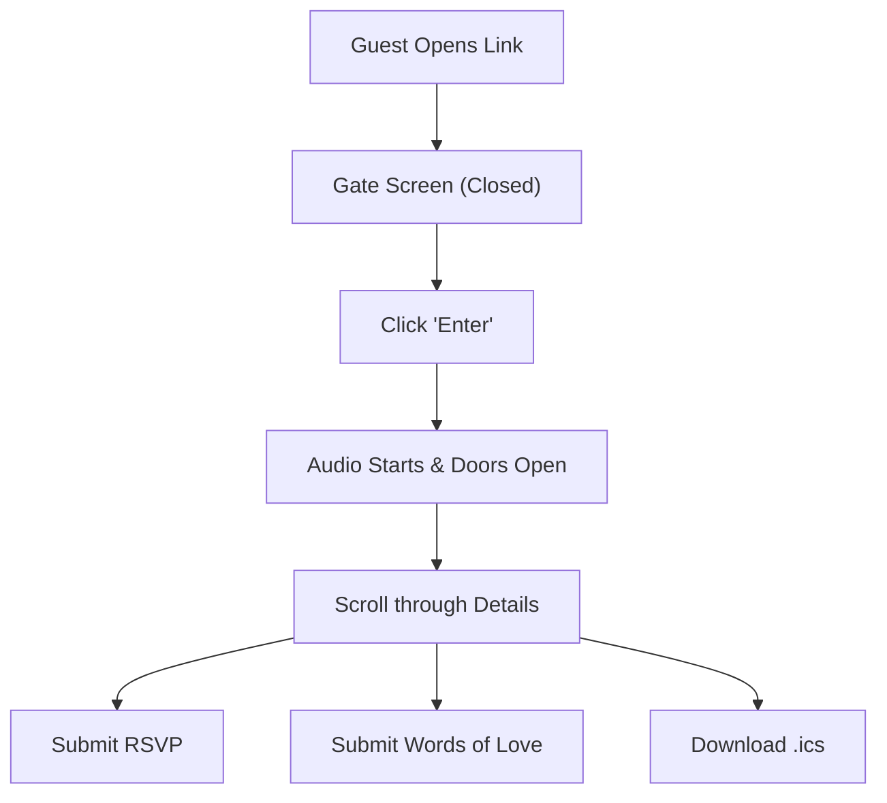

## 1. Product Overview
A high-end, luxury, highly interactive 2.5D wedding invitation website for "Aleeza weds Ibrahim".
- Purpose: Provide a digital, immersive, and elegant wedding invitation experience that captures the royal South Asian theme.
- Target Value: Create a memorable first impression for guests with cinematic animations, atmospheric music, and seamless interactivity.

## 2. Core Features

### 2.1 User Roles
| Role | Registration Method | Core Permissions |
|------|---------------------|------------------|
| Guest | None (Direct Link) | View invitation, play music, submit RSVP, leave messages, download calendar invite |

### 2.2 Feature Module
1. **Interactive Landing (Gate Screen)**: Majestic double-door entry with "Enter" interaction and audio initialization.
2. **Cinematic Reveal**: GSAP-powered door split animation revealing the royal banquet interior.
3. **Information Slides**: Multi-slide vertical scroll flow for invitation details, venue, artist performance, and countdown.
4. **Interactive Forms**: RSVP and "Words of Love" guest book message board.
5. **Utility Features**: Global audio control, Save the Date (.ics download), and live countdown timer.
6. **Magical Effects**: 2.5D parallax depth and golden particle ambiance.

### 2.3 Page Details
| Page Name | Module Name | Feature description |
|-----------|-------------|---------------------|
| Invitation | Gate Screen | Full-screen interactive gate with "Enter" button and audio trigger. |
| Invitation | Reveal Hall | Monogram and introductory text with cinematic transition. |
| Invitation | Main Details | Core wedding invitation text with ornate borders and floral accents. |
| Invitation | Venue | Detailed event location and timing with architectural silhouettes. |
| Invitation | Artist | Performance showcase for Amanat Ali with description and timing. |
| Invitation | RSVP Form | Functional state-managed form for guest attendance. |
| Invitation | Guest Book | Message submission form for "Words of Love". |
| Invitation | Countdown | Live ticker to event date and .ics calendar file download. |

## 3. Core Process
1. Guest opens the website → Sees the majestic closed gate.
2. Guest clicks "ENTER THE CELEBRATION" → Music starts, doors slide open cinematic revelation.
3. Guest scrolls down → Experiences a series of parallax-enhanced slides with wedding details.
4. Guest interacts with RSVP/Guest Book → Submits attendance and wishes.
5. Guest clicks "SAVE THE DATE" → Downloads calendar reminder.

## 4. User Interface Design
### 4.1 Design Style
- Primary Colors: Deep Royal Maroon (#4A0404), Burnished Antique Gold (#C5A059), Velvet Black (#1A0F0F).
- Accent Colors: Candle-warm Amber (#FFBF00), Crimson Rose (#8B0000).
- Typography: Luxury Calligraphy/Script for names (e.g., Pinyon Script), Serif for headers (e.g., Playfair Display), Elegant Sans-serif for body.
- Button Style: Gold-bordered, shimmering hover effects, active scale interaction.
- Layout Style: Full-screen vertical scroll (Single Page Application).

### 4.2 Page Design Overview
| Page Name | Module Name | UI Elements |
|-----------|-------------|-------------|
| Invitation | Gate Screen | Majestic antique door assets, maroon drapes, lanterns, gold-bordered button. |
| Invitation | Detail Slides | Ornate gold borders, South Asian arches, floral rose/gold leaf accents, 2.5D parallax layers. |
| Invitation | Particles | Floating golden dust spheres drifting upwards across all slides. |

### 4.3 Responsiveness
- Desktop-first with mobile-adaptive scaling.
- Flexible Tailwind grid/flex layouts.
- Dynamic font scaling and asset resizing for mobile screens.

### 4.4 2.5D Scene Guidance
- Parallax: GSAP ScrollTrigger shifting background/decorative layers at different speeds.
- Ambiance: Lightweight HTML5 Canvas particle loop for golden glow.
- Transitions: Smooth fade-ins and staggered reveals for text and motifs.
