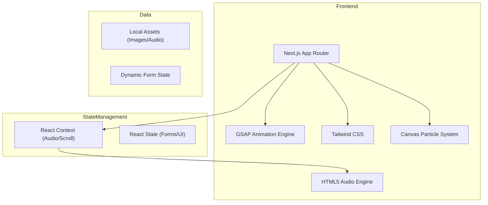

## 1. Architecture Design

## 2. Technology Description
- Frontend: Next.js 14+ (App Router) + React 18
- Styling: Tailwind CSS
- Animations: GSAP (GreenSock) + ScrollTrigger
- Icons: Lucide-react
- State: React Context for global audio and scroll-lock management
- Utilities: `ics` (optional) or manual blob generation for calendar invites

## 3. Route Definitions
| Route | Purpose |
|-------|---------|
| / | Main immersive wedding invitation experience |

## 4. Components Structure
- `layout.tsx`: Root layout with audio context provider and global styles.
- `page.tsx`: Main container orchestrating the slides and GSAP timeline.
- `components/GateScreen.jsx`: Initial landing screen with door animation.
- `components/RevealHall.jsx`: Monogram and intro text.
- `components/InvitationDetails.jsx`: Main wedding request slide.
- `components/VenueDetails.jsx`: Location and timing information.
- `components/ArtistPerformance.jsx`: Amanat Ali showcase.
- `components/RSVPForm.jsx`: Attendance form component.
- `components/GuestBook.jsx`: Words of Love message board.
- `components/Countdown.jsx`: Live timer and Save the Date button.
- `components/AudioControl.jsx`: Fixed glassmorphic audio toggle.
- `components/ParticleBackground.jsx`: Canvas-based golden dust animation.

## 5. Global State (AudioContext)
- `isPlaying`: boolean
- `isInitialized`: boolean (audio starts after first interaction)
- `togglePlay()`: function to play/pause

## 6. Scroll Management
- Initial state: `overflow: hidden` on body.
- Post-Gate interaction: `overflow: auto` or GSAP-managed smooth scroll.
